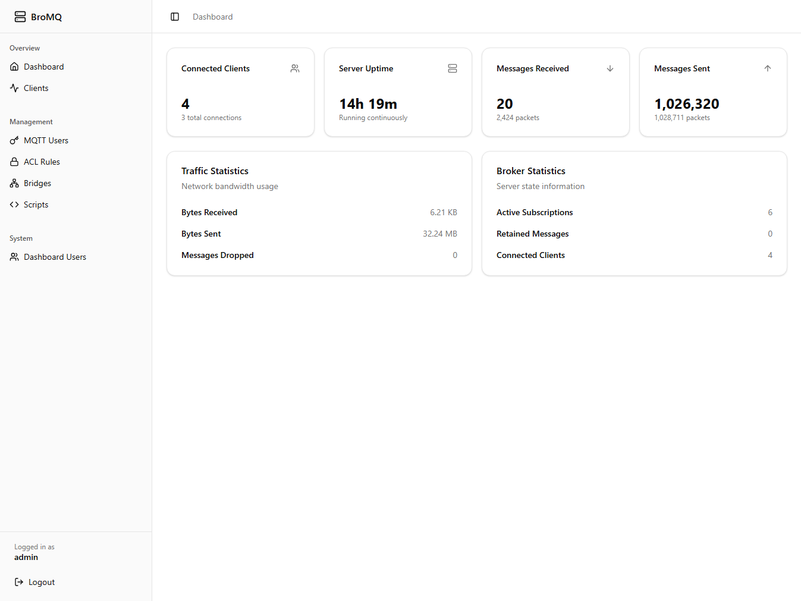
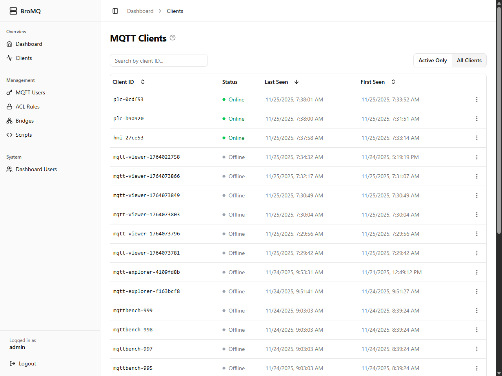
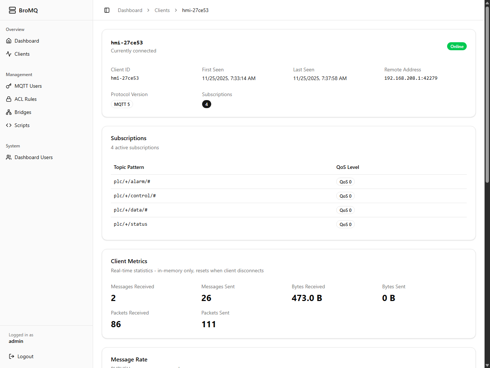
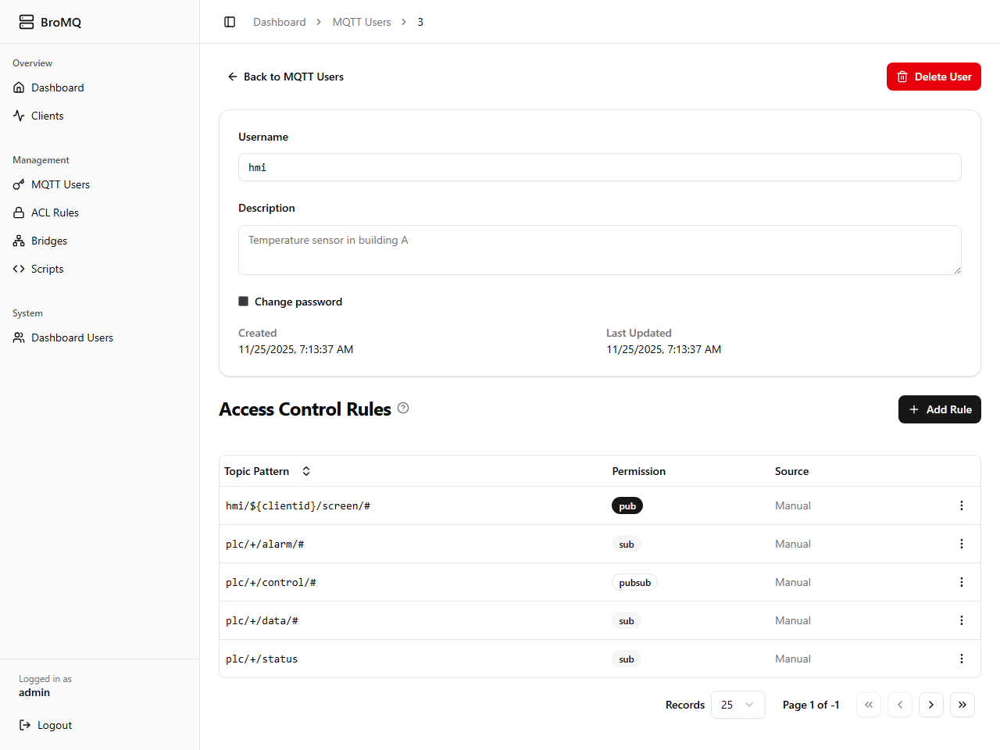
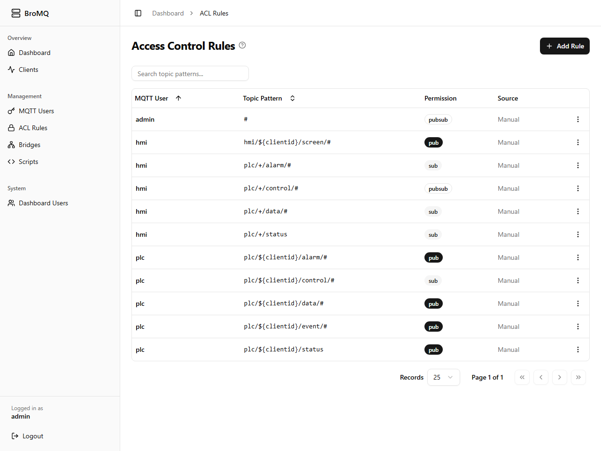
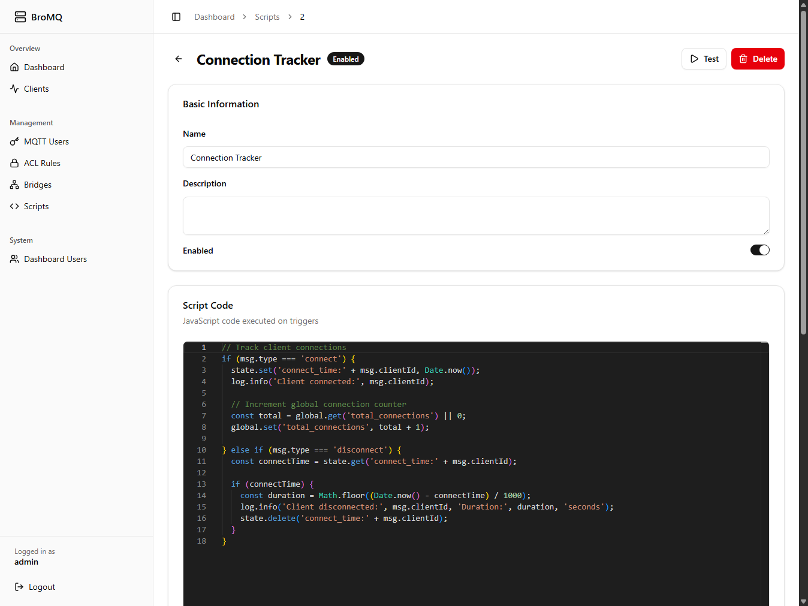

# BroMQ

[](https://github.com/bherbruck/bromq/actions)
[](https://goreportcard.com/report/github.com/bherbruck/bromq)
[](LICENSE)
[](go.mod)
[](https://github.com/bherbruck/bromq/releases)

Batteries-included, production-ready MQTT broker.

## Why BroMQ?

**Truly open source.** Every feature unlocked, no enterprise tiers, no connection limits. Apache 2.0 licensed, use it however you want.

**Batteries-included, single binary.** Web dashboard, REST API, user management, ACL system, client tracking, MQTT bridging, and Prometheus metrics in one small binary. No plugins required.

## Use Cases

- IoT infrastructure and device management
- Smart home automation
- Industrial monitoring and control (IIoT)
- Edge-to-cloud architectures via MQTT bridging
- Real-time data streaming and telemetry
- Multi-tenant SaaS platforms with topic isolation
- Vehicle telematics and fleet management
- Building automation and energy management
- Mobile and web application backends
- Kubernetes and Docker deployments
- Development and testing environments

## Comparisons

**vs. Open-core brokers:** No feature paywalls, license pop-ups, or artificial connection limits
**vs. Mosquitto:** Includes web UI, REST API, and database-backed authentication
**vs. Cloud platforms:** No per-connection pricing, deploy anywhere
**vs. Enterprise solutions:** Simpler deployment, no support contracts required

## Feature Comparison

| Feature                | BroMQ                         | EMQX 5.9+       | VerneMQ           | Mosquitto         | HiveMQ            |
| ---------------------- | ----------------------------- | --------------- | ----------------- | ----------------- | ----------------- |
| License                | Apache 2.0                    | BSL 1.1\*       | Apache 2.0\*\*    | EPL 2.0/EDL       | Commercial        |
| Distributed Topologies | ✅ Bridges                    | 💰 Licensed     | ✅ Masterless     | ✅ Bridges        | ⚠️ Enterprise     |
| Web Dashboard          | ✅ Built-in                   | ✅ Built-in     | ❌ Community only | ❌                | ⚠️ Enterprise     |
| REST API               | ✅ Full                       | ✅ Full         | ✅ CLI wrapper    | ❌                | ⚠️ Enterprise     |
| Database Auth          | ✅ Built-in                   | ✅ Built-in     | ✅ Plugins        | ❌ File-based     | ⚠️ Enterprise     |
| Access Control         | ✅ Granular DB-backed         | 💰 Advanced ACL | ⚠️ Plugins only   | ⚠️ Basic file ACL | 💰 Enterprise ACL |
| Automation / Scripting | ✅ Embedded javascript engine | 💰 Rules engine | ⚠️ Lua plugins    | ❌                | 💰 Extensions     |
| Connection Limit       | ∞ Unlimited                   | ∞ Single-node   | ∞ Unlimited       | ∞ Unlimited       | 💰 Licensed       |

\*BSL 1.1: Single-node free, clustering requires license, converts to Apache 2.0 after 4 years
\*\*Source code Apache 2.0, official packages/Docker images under EULA

**When BroMQ is the right choice:**

- You want batteries-included (web UI, REST API, auth, ACL, scripting) without enterprise licensing
- You want GitOps-friendly declarative YAML config for bridges, users, ACL, and more
- You're deploying to VPS/cloud/edge with bridging support (works as edge OR cloud broker)
- You're deploying to Kubernetes/Docker

**When to consider alternatives:**

- **Massive scale** (>100K connections): EMQX, VerneMQ
- **Ultra-lightweight** (<5MB): Mosquitto
- **Enterprise support contracts**: HiveMQ, EMQX Enterprise

> **Note:** Performance benchmarks (concurrent connections, message throughput, latency, memory footprint) are currently being prepared and will be published soon to help users evaluate BroMQ for their specific workloads.

## Features

- **Full MQTT v3/v5 support** with NoLocal subscriptions for loop-free bridges
- **Multi-database support** - SQLite (default), PostgreSQL, MySQL
- **Separate user types** - Dashboard admins and MQTT device credentials managed independently
- **Secure authentication** with database-backed password storage
- **Granular ACL permissions** - Per-user topic access control for publish/subscribe with wildcard support (`+`, `#`) and dynamic placeholders (`${username}`, `${clientid}`)
- **MQTT Bridging** - Connect to remote brokers with bidirectional topic routing
- **JavaScript scripting engine** - Custom automation and message processing on MQTT events
- **REST API** for comprehensive management (users, credentials, clients, ACL, bridges, scripts)
- **Modern Web Dashboard** with real-time monitoring and management
- **Client connection tracking** - Monitor individual devices with metadata
- **Configuration provisioning** - YAML-based configuration with auto-sync - ideal for GitOps deployments
- **Single binary deployment** with embedded frontend
- **Full Docker support** with multi-platform images
- **Prometheus metrics** endpoint for monitoring

## Distributed Topologies

**Architecture Model:** BroMQ uses an explicit hub-spoke architecture based on MQTT bridging. Spoke brokers scale horizontally for client connections; hub brokers aggregate and route messages.

```
MQTT Clients
     │
     ├──► Spoke Broker (Region A) ───┐
     ├──► Spoke Broker (Region B) ───┼──► Hub Broker ◄──► External Systems
     └──► Spoke Broker (Region C) ───┘
```

BroMQ supports distributed MQTT deployments using **MQTT v5 NoLocal bridging**:

- **Hub-and-spoke architectures** - Central hub with multiple edge brokers
- **Edge-to-cloud synchronization** - Reliable data forwarding with automatic reconnection
- **Multi-site aggregation** - Connect brokers across locations with topic routing
- **Regional distribution** - Deploy spoke brokers per region/datacenter, bridge to central hub
- **Bidirectional bridges** - Loop-free message routing with NoLocal subscriptions

BroMQ focuses on clarity and explicitness: multi-node deployments use declarative, configurable bridging rather than opaque automatic clustering. This provides full operational transparency and avoids the complexity and brittleness of distributed cluster protocols.

Enterprise topologies such as multi-hub deployments are supported through explicit bridging configurations. BroMQ intentionally avoids hidden or proprietary clustering, giving you full control over how nodes route traffic.

**Note:** BroMQ nodes do not share session or routing state. Distributed deployments route through one or more explicit hub brokers configured via MQTT bridging.

**BroMQ does not implement:**

- Automatic clustering with shared state
- Distributed session synchronization
- Multi-node routing table coordination

For these use cases, consider VerneMQ or EMQX Enterprise.

See [examples/config/bridge/](examples/config/bridge/) for hub-and-spoke configuration examples.

## Technology Stack

BroMQ is built in **Go** for modern cloud-native environments:

- **Go** - Minimal memory footprint, excellent concurrency, fast startup times
- **Single static binary** - No runtime dependencies, simple deployment
- **Cross-platform** - Linux, macOS, Windows (amd64, arm64, armv7)
- **Multi-database support** - SQLite, PostgreSQL, MySQL with GORM
- **Container-native** - Official multi-platform Docker images
- **Prometheus integration** - Standard metrics format for observability

Go's simplicity and performance make BroMQ easy to deploy, extend, and integrate compared to Erlang/Java-based brokers.

## Screenshots

### Dashboard Overview



### MQTT Client Management




### User Management



### ACL Rules



### JavaScript Scripting



## Quick Start

### Docker Compose (Recommended)

**Production (single binary with embedded UI):**

```bash
# Start the server
docker compose up -d

# View logs
docker compose logs -f

# Stop the server
docker compose down
```

### Access Points

After starting:

- **MQTT TCP:** `localhost:1883`
- **MQTT WebSocket:** `localhost:8883`
- **Web Dashboard:** `http://localhost:8080`
- **Default Login:** `admin` / `admin` (Change immediately in production)

## Configuration Example

BroMQ supports declarative YAML configuration for GitOps workflows:

```yaml
# config.yml - Auto-syncs to database on startup
users:
  - username: sensors
    password: ${MQTT_SENSOR_PASSWORD} # Env var interpolation
    description: "IoT sensor fleet"

  - username: cameras
    password: ${MQTT_CAMERA_PASSWORD}
    description: "Camera devices"

  - username: admin
    password: admin

acl_rules:
  # Multi-tenant isolation with reserved dynamic placeholders
  - username: sensors
    topic: "devices/${username}/#" # Each user isolated
    permission: pubsub

  - username: cameras
    topic: "video/${clientid}/stream" # Per-device topics
    permission: pub

  - username: admin
    topic: "#" # Full access
    permission: pubsub

bridges:
  - name: cloud-bridge
    host: mqtt.example.com
    port: 8883
    topics:
      - local: "data/#"
        remote: "edge/site-1/data/#"
        direction: out

      - local: "commands/#"
        remote: "edge/site-1/commands/#"
        direction: in
```

```bash
# Run with config
export MQTT_SENSOR_PASSWORD="secret123"
export MQTT_CAMERA_PASSWORD="camera456"

# Set custom admin credentials (only used on first run)
export ADMIN_USERNAME="myadmin"
export ADMIN_PASSWORD="securepassword"

docker run \
  -e MQTT_SENSOR_PASSWORD \
  -e MQTT_CAMERA_PASSWORD \
  -e ADMIN_USERNAME \
  -e ADMIN_PASSWORD \
  -v ./config.yml:/app/config.yml \
  bromq -config /app/config.yml
```

**Note:** `ADMIN_USERNAME` and `ADMIN_PASSWORD` environment variables only work on first startup. To change the admin password later, use the web UI or API.

See [examples/config/](examples/config/) for more examples.

### IDE Autocomplete Support

BroMQ provides a JSON Schema for YAML configuration files, enabling IDE autocomplete and validation:

```yaml
# Add this line to the top of your config.yml
# yaml-language-server: $schema=https://github.com/bherbruck/bromq/releases/latest/download/bromq-config.schema.json

users:
  - username: sensor_user # IDE will show autocomplete here!
    password: ${PASSWORD}
```

**Schema URLs:**

- Latest: `https://github.com/bherbruck/bromq/releases/latest/download/bromq-config.schema.json`

## License

Apache 2.0
